# PrintifyX: Enterprise-Grade Custom Printing E-Commerce Ecosystem

PrintifyX is a high-performance, full-stack e-commerce platform architected to handle the complex requirements of custom printing services. It features a dynamic product catalog, real-time order lifecycle tracking, and a robust administrative suite for product orchestration.

## 🚀 Live Demo & Repository
- **Live Site**: [Insert Your Vercel Link Here]
- **GitHub Repository**: [Insert Your GitHub Link Here]

---

## 🛠️ Key Architectural Highlights

### 1. Dynamic Content Orchestration
The platform is built on a "Server-Driven" philosophy. The storefront is entirely dynamic—any changes made in the Admin Dashboard (new products, updated pricing, category shifts) are reflected instantly across the frontend without requiring code changes or redeployments.

### 2. Advanced Identity & Security
Implemented a multi-mode authentication engine using **Spring Security**.
- **Social Login**: Seamless Google OAuth2 integration with automatic account linking.
- **Secure Sessions**: Stateless JWT-based authentication for scalable session management.
- **Account Recovery**: OTP-based email verification system for secure password resets.

### 3. Production Infrastructure & Resilience
The system is optimized for real-world production challenges:
- **Zero Latency (Health Monitoring)**: Implemented custom health-check endpoints and external monitoring (UptimeRobot) to eliminate cold-start delays on serverless/free-tier hosting.
- **Cross-Origin Security**: Configured granular CORS preflight policies to secure communication between Vercel (Frontend) and Render (Backend).
- **Database Evolution**: Managed 23+ versioned **Flyway** migrations to ensure zero-downtime schema updates in the production PostgreSQL environment.

---

## 💻 Technology Stack

### Backend (The Core)
- **Java / Spring Boot**: High-performance RESTful API architecture.
- **Spring Security (OAuth2/JWT)**: Enterprise-grade security and identity management.
- **PostgreSQL**: Robust relational data storage.
- **Flyway**: Database schema versioning and migrations.
- **Cloudinary**: Cloud-based asset management for product imagery.
- **Docker**: Containerized deployment environments for consistent execution.

### Frontend (The Experience)
- **React (TypeScript)**: Type-safe, component-driven UI architecture.
- **Vite**: Ultra-fast build tool and development server.
- **Tailwind CSS**: Modern utility-first styling for responsive design.
- **Lucide-React**: Premium iconography system.
- **Sonner**: Asynchronous, non-disruptive notification engine for real-time feedback.

---

## 📂 Project Structure & Workflow

### Database Schema Design
The project uses a normalized relational schema designed for e-commerce scalability:
- **User Management**: Unified table for OAuth2 and local credentials with role-based flags.
- **Product Engine**: Decoupled Category and Product entities with dynamic attribute support.
- **Order Lifecycle**: Multi-table structure tracking `Orders` -> `OrderItems` -> `Customizations`, ensuring data integrity across complex custom orders.

### Development Workflow
1. **Frontend**: Component-based architecture with a centralized `cart.service` and `apiClient` for consistent state management.
2. **Backend**: Controller-Service-Repository pattern ensuring clean separation of concerns and testability.
3. **CI/CD**: Automatic deployments via GitHub hooks to Vercel (Frontend) and Render (Backend), with environment variables secured at the platform level.

---

## ✨ Core Features

- **Interactive Customizer**: Configurable product design interface with dynamic metadata handling.
- **Role-Based Portals**:
  - **User Dashboard**: Personalized order history, real-time shipment tracking, and address management.
  - **Admin Dashboard**: Full-fleet product management, category orchestration, and system-wide order oversight.
- **Intelligent Discovery**: Refined search logic with character-cluster highlighting and popularity-based "Trending Products" engine.
- **Fluid Checkout**: Structured cart management and multi-method simulated payment integration (UPI/Card/Razorpay).

---

## 📸 Recommended Screenshots

*To make your portfolio stand out, I recommend adding the following 7 screenshots:*

1.  **Main Landing Page**: Hero section showing the premium branding.
2.  **Product Customizer**: Show the specific UI where users select design options.
3.  **User Profile Dashboard**: Highlights the "User Dashboard" and order list.
4.  **Admin Product Fleet**: Shows the "Admin Dashboard" with the product table and toggle switches.
5.  **Live Order Tracker**: The visual stepper showing order progress (Paid -> Printing -> Shipped).
6.  **Mobile Responsive View**: A side-by-side of the site on desktop and mobile.
7.  **Google Login Screen**: Proves the "Advanced Identity Management" implementation.

---

## ⚙️ Local Setup

### Backend
1. Clone the repo and navigate to `/backend`.
2. Configure your `application.properties` with PostgreSQL and Cloudinary credentials.
3. Run `./mvnw spring-boot:run`.

### Frontend
1. Navigate to `/frontend`.
2. Create a `.env` file with `VITE_API_BASE_URL`.
3. Run `npm install` followed by `npm run dev`.

---

## 📸 Current Visuals

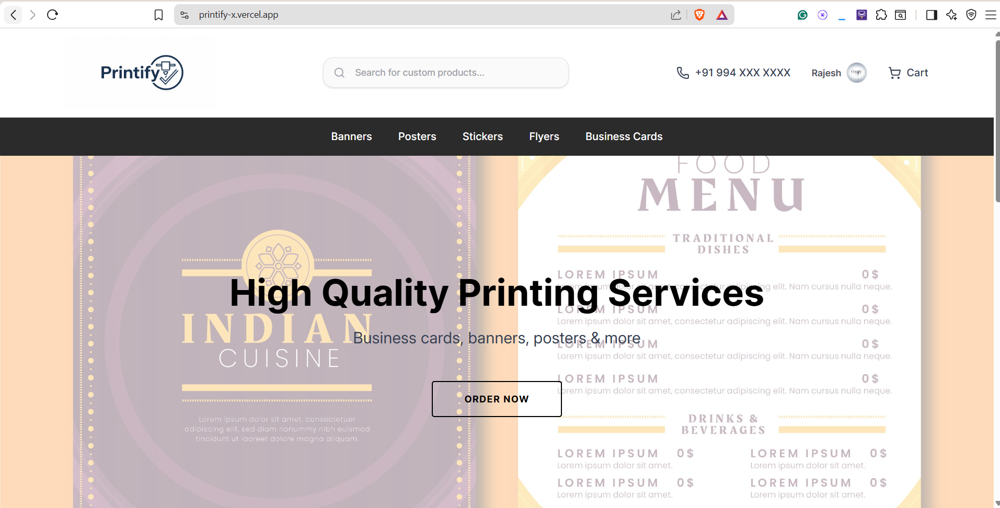
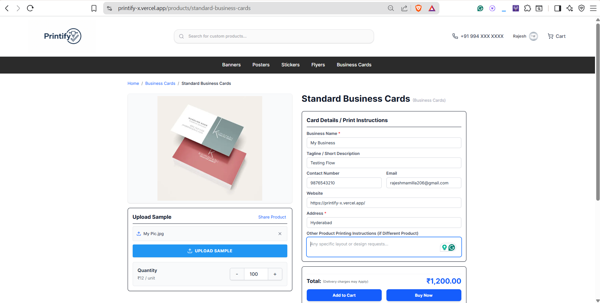
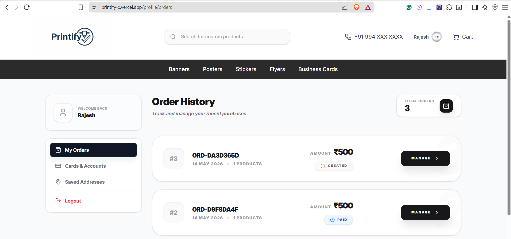
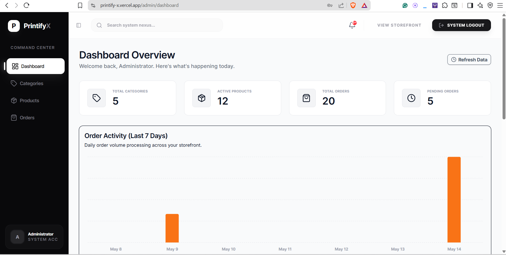
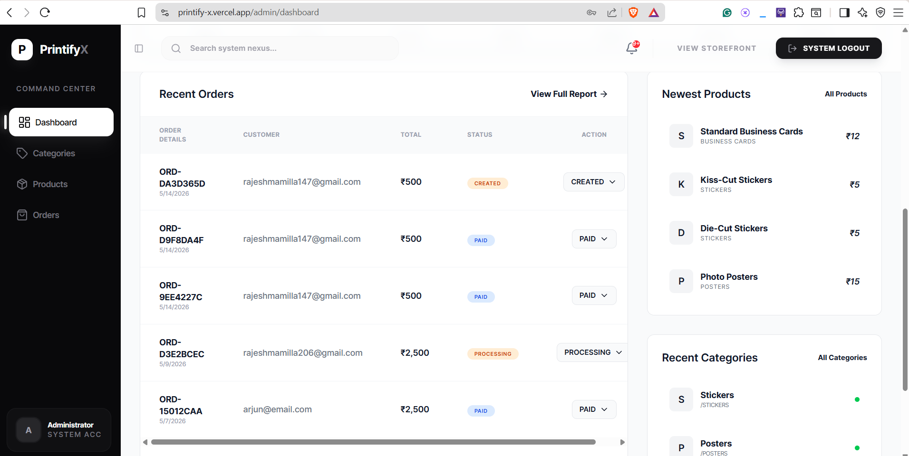
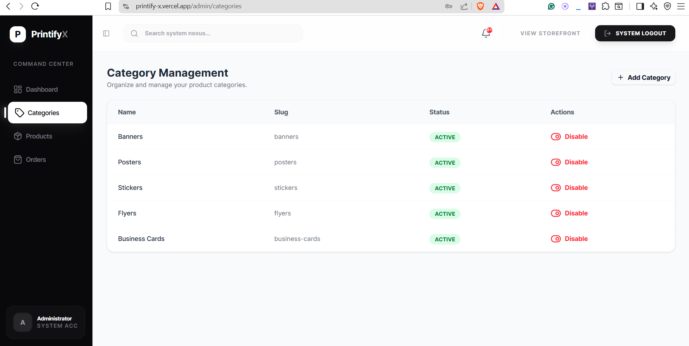
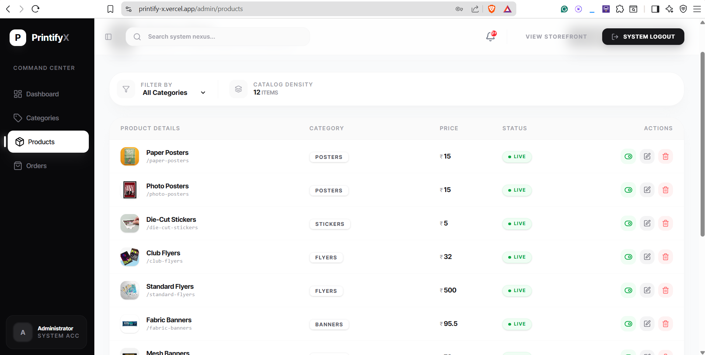
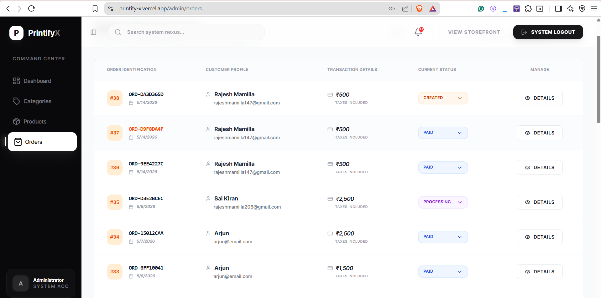
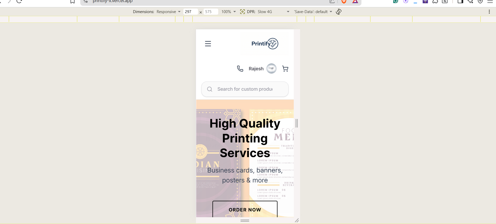
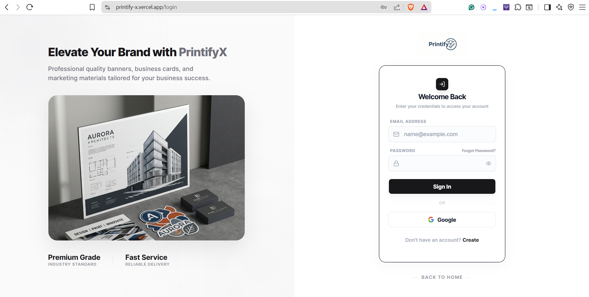

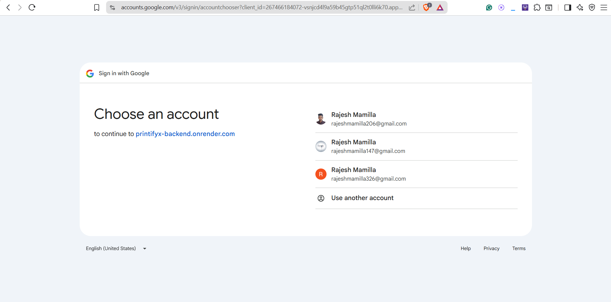
